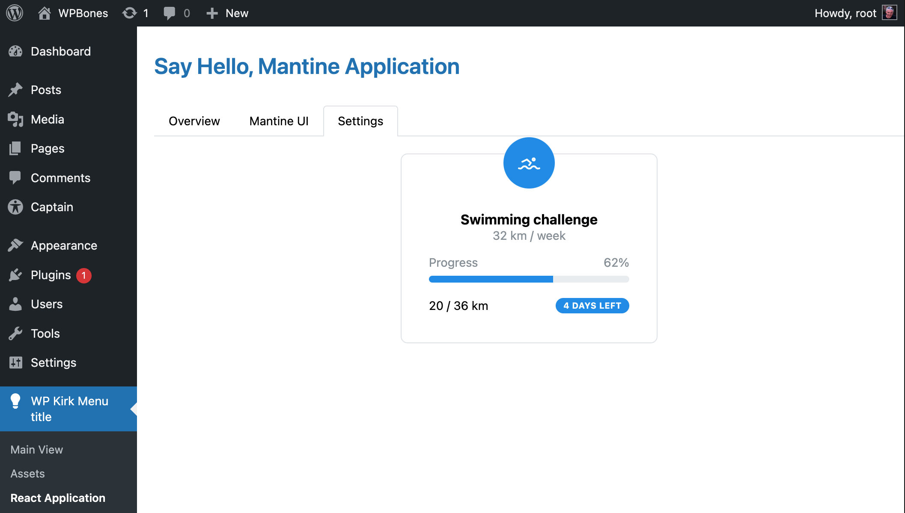

import { ActionButton, AnimateBadge, Boilerplate, DocsBoilerplateDemo, FileTreeLabel } from "@/components";
import { Badge, Button, Center, Group } from '@mantine/core';
import { IconArticle, IconBrandGithub, IconBrandSlack, IconBrandWordpress, IconExternalLink, IconPlug } from "@tabler/icons-react";
import { Callout, Cards, FileTree, Steps } from 'nextra/components';

# ReactJS Applications

This document explains how to create a more complex ReactJS application in your WP Bones plugin. It covers creating a menu in the `config/menu.php` file, creating a controller using the `php bones make:controller` command, and setting up the controller to return a view with an admin script. The ReactJS applications are stored in the `resources/assets/apps/` folder, and dependencies need to be installed as described in the Assets section.

---
<DocsBoilerplateDemo slug="mantine" />
---

## Overview

If you want to create a more complex ReactJS application, you can use the `resources/assets/apps/` folder.

First of all, you need to install the dependencies as described in the [Assets section](../getting-started/assets).

<Callout>
Feel free to also install any other dependencies you need. You could install Mantine UI, React Router, etc.
</Callout>


<Steps>
## Create the Menu

First of all, let's create a menu. Open the `config/menu.php` file and add the following code to the [menu list](../core-concepts/menus):

```php copy
[
  'menu_title' => 'React Application',
  'route' => [
    'get' => 'ReactAppController@index',
  ],
],
```

## Create the Controller

By using the `php bones` command, you can create a controller and a view at the same time. Run the following command:

```shell copy
php bones make:controller ReactAppController
```

This command will create `plugin/Http/Controllers/ReactAppController.php`. Open the file and add the following code:

```php copy
<?php

namespace WPKirk\Http\Controllers;

if (! defined('ABSPATH')) {
    exit;
}

use WPKirk\Http\Controllers\Controller;

class ReactAppController extends Controller
{

  public function index()
  {
      return WPKirk()
        ->view('react-app' )
        ->withAdminAppsScript('app'); 
  }

  public function store()
  {
    // POST
  }

  public function update()
  {
    // PUT AND PATCH
  }

  public function destroy()
  {
    // DELETE
  }

}
```

<Callout type="info">
Maybe you will need to replace the namespace and the  `WPKirk()` function.
</Callout>

## withAdminAppsScript()

The `withAdminAppsScript()` method is used to load the ReactJS application. The first parameter is the name of the application and the second parameter indicates whether the CSS modules should also be loaded. The default value is `true`.

```php copy
return WPKirk()
  ->view('react-app' )
  ->withAdminAppsScript('app', false); // without CSS modules
```

You may also create a global variable that can be used in the ReactJS application.

```php copy
return WPKirk()
  ->view('react-app' )
  ->withAdminAppsScript('app', true, 'ReactApp', [
    'tab' => 'settings',
  ]);
```
The above example will create a global variable called `ReactApp` with the value `{ tab: 'settings' }`.

## Create the view

In the `resources/views` folder, create a new file called `react.php` and add the following code:

```html copy
<h1>React Application Example</h1>
<div id="react-app"></div>
```

<Callout>
You may create any complex view. This is just an example.
</Callout>

## Create the React Application

In your `resources/assets/apps/` folder, create a new file called `app.tsx` and add the following code:

```tsx copy
import '@mantine/core/styles.css';

import { MantineProvider } from '@mantine/core';
import { createRoot } from '@wordpress/element';
import { __ } from '@wordpress/i18n';

import { Demo } from './components/Demo';
import classes from './app.module.scss';

const App = () => (
  <MantineProvider>
    <h2 className={classes.title}>{__('Say Hello, Mantine Application', 'wp-kirk')}</h2>
    <Demo />
  </MantineProvider>
);

const container = document.getElementById('react-app');
if (container) {
  createRoot(container).render(<App />);
}
```

<Callout type="info">
The above code is just an example. You may create any complex ReactJS application. Here we're using the [Mantine UI](https://mantine.dev/) library as well as [React Router](https://reactrouter.com/). In addition, we're using other components in the `components` folder.
</Callout>

<FileTree>
  <FileTree.Folder name="resources" defaultOpen>
      <FileTree.Folder name="assets" defaultOpen>
        <FileTree.Folder name="apps" defaultOpen>
            <FileTree.File name={<FileTreeLabel type="file" name="app.tsx">Main ReactJS</FileTreeLabel>} />
            <FileTree.File name={<FileTreeLabel type="file" name="app.module.css">CSS module</FileTreeLabel>} />
            <FileTree.Folder name="components" defaultOpen>
              <FileTree.File name={<FileTreeLabel type="file" name="Demo.tsx">ReactJS</FileTreeLabel>} />
            </FileTree.Folder>
        </FileTree.Folder>
      </FileTree.Folder>
  </FileTree.Folder>
</FileTree>

## Start the development server

Now, you can start the development server by running the following command:

```shell copy
yarn dev
```
That's all



</Steps>

## Production Build

Obviously, once completed, remember to run the build command:

```shell copy
yarn build
```

---
<DocsBoilerplateDemo slug="mantine" />