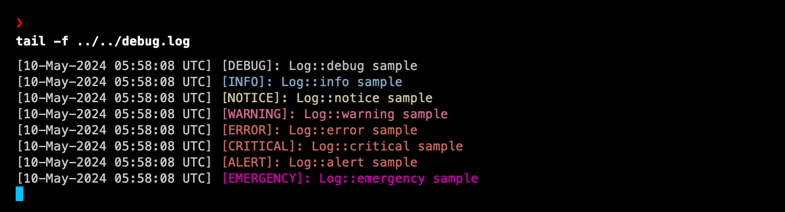

import { FileTreeLabel } from '@components/FileTreeLabel'
import { Callout, FileTree } from 'nextra/components'

# Logging

To help you learn more about what's happening within your plugin, you can use the `error_log()` function. As you know, within WordPress, you can enable logging by adding the following lines in the `wp-config.php` file:

```php filename="wp_config.php" copy
/**
 * For developers: WordPress debugging mode.
 *
 * Change this to true to enable the display of notices during development.
 * It is strongly recommended that plugin and theme developers use WP_DEBUG
 * in their development environments.
 */
 define('WP_DEBUG', true);
 define('WP_DEBUG_LOG', true );
 define('WP_DEBUG_DISPLAY', false );
 ini_set('display_errors', 0 );
```

Anyway, WPBones provides additional configuration that allows you to log messages to files in an easy and beautiful way.

### Configuration

You can find the configuration for your plugin's logging in the `config/plugin.php`:

```php filename="config/plugin.php" copy
if (!defined('ABSPATH')) {
    exit();
}
/*
|--------------------------------------------------------------------------
| Logging Configuration
|--------------------------------------------------------------------------
|
| Here you may configure the log settings for your plugin.
|
| Available Settings: "single", "daily", "errorlog".
|
| Set to false or 'none' to stop logging.
|
*/

'log' => 'errorlog',

'log_level' => 'debug',
```

### Configuring the logging type

By default, the channel driver is set to `errorlog`. This means that you'll find the WPBones log in the default WordPress log file, usually `/wp-content/debug.log`. You may use the `single` or `daily` driver as well. In this case, you'll find the log file in the `/storage/logs/` folder within your plugin folder.

The `single` channel driver will create a single log file in `/storage/logs/debug.log`.
The `daily` channel driver will create a daily log file in `/storage/logs/20180401.log`.

### Write Log Messages

You may write information to the logs using the `Log` class or the `log()` method from your plugin instance.
The logger provides the eight logging levels defined in the [RFC 5424 specification](https://tools.ietf.org/html/rfc5424): emergency, alert, critical, error, warning, notice, info, and debug:

```php copy
use YourNamespace\WPBones\Foundation\Log\Log;

class MyClass {

  public function myMethod()
  {
    Log::debug( 'info', [ 'context' => 'any' ] );
  }
}
```



As you can see, the log row will be rendered with colored console. In this way, it will be easy to find your logs.
As mentioned, you may use the global plugin instance function to access the log provider.

```php copy
use YourNamespace\WPBones\Foundation\Log\Log;

class MyClass {

  public function myMethod()
  {
    Plugin()->log()->debug( 'info', [ 'context' => 'any' ] );
  }
}
```

In the service provider, you may use:

```php copy
use YourNamespace\WPBones\Foundation\Log\Log;
use YourNamespace\WPBones\Support\ServiceProvider;

class MyServiceProvider extends ServiceProvider {

  public function register()
  {
    $this->plugin->log()->debug( 'info', [ 'context' => 'any' ] );
  }
}
```

## Helper functions

You may also use the `logger()` function

```php copy
logger()->debug('Hello, World');
logger()->info('Hello, World');
```

As `logger()` is a common function name, if you encounter any issues, such as conflicts, you can use `wpbones_logger()` instead. In reality, `logger()` is simply an alias of `wpbones_logger()`.

```php copy
wpbones_logger()->debug('Hello, World');
wpbones_logger()->info('Hello, World');
```