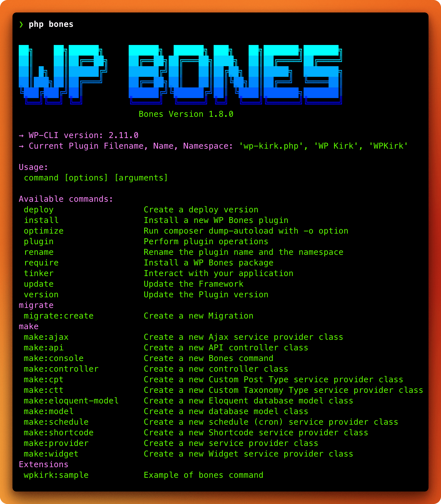

import { IconArticle, IconBrandGithub, IconBrandSlack, IconBrandWordpress, IconPlug } from "@tabler/icons-react";
import { Callout, Cards, Steps } from 'nextra/components';

# Installation

<Steps>
### Create your local WordPress installation

First of all, you should prepare the development environment. I may suggest the following:

-  [Vagrant](https://github.com/gfazioli/VagrantUbuntu)
-  [Valet](https://laravel.com/docs/10.x/valet)

<Callout type="info" emoji="💡">
I suggest you also use [PHP Monitor](https://phpmon.app/), a lightweight, native Mac menu bar app that works best when accompanied by [Laravel Valet](https://github.com/laravel/valet) (but it also works without it).
</Callout>

To start developing a WP Bones plugin, you must have a copy of WordPress files. You can download the latest WordPress release from [wordpress.org](http://wordpress.org).

### Create your plugin

To create your WP Bones plugin, you can use one of our [ready-made boilerplate templates](./boilerplate-templates) available on GitHub. You can choose one of the following:

-  [WPKirk Boilerplate](https://github.com/wpbones/WPKirk-Boilerplate) - this is the base template, without examples inside, **recommended for experienced users**.
-  [WPKirk Complete Demo](https://github.com/wpbones/WPKirk) - this is the template with several examples inside, **recommended for beginners**.

<Callout type="warning">
The [WPKirk Complete Demo](https://github.com/wpbones/WPKirk) requires PHP version 8.2+ or higher due to the illuminate/database package.
</Callout>


For both, you can choose to create your repository on GitHub using the available templates or clone the repository directly to your computer.

#### By using the GitHub template

On GitHub, you can create a new repository using the [WPKirk Boilerplate](https://github.com/wpbones/WPKirk-Boilerplate) by clicking on the "Use this template" button on the repository page.


<Cards num={1}>

<Cards.Card arrow icon={<IconBrandGithub />} title="Create your repository starting from a complete demo - beginners" target="\_blank" href="https://github.com/new?template_name=WPKirk&template_owner=wpbones"/>

<Cards.Card arrow icon={<IconBrandGithub />} title="Create your repository starting from a empty boilerplate - advanced users" target="\_blank" href="https://github.com/new?template_name=WPKirk-Boilerplate&template_owner=wpbones"/>

</Cards>

#### Clone from GitHub

You may also clone the repository using either the Git command line or the GitHub for Mac application.
Change the directory to the `wp-content/plugins` folder of your local WordPress installation.

```sh copy
cd wp-content/plugins
```

The complete demo

```sh copy
git clone -b main https://github.com/wpbones/WPKirk.git <your plugin folder>
```

The simple boilerplate

```sh copy
git clone -b main https://github.com/wpbones/WPKirk-Boilerplate.git <your plugin folder>
```

<Callout type="warning">
If you have cloned the repository instead of using the GitHub template, you should remove the `.git` folder before creating your own Git repository.
So run

```sh copy
rm -rf .git
```

</Callout>

### Install the necessary packages to compile the assets

From within your plugin folder, run:

```sh npm2yarn
npm install
```

Take a look at the [Assets](assets) section to learn more.

### Check the installation

Next, from inside your plugin folder, try to run:

```shell copy
php bones
```

You should see:



### Install

Finally, install the WP Bones Framework inside the plugin:

```shell copy
php bones install
```

> 👏 Awesome! You are ready to start developing your first WP Bones plugin.

</Steps>
