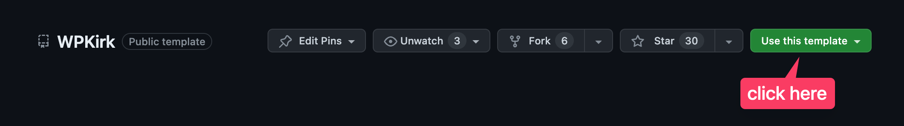

import { Callout } from 'nextra/components'

# Installation

First of all, you should prepare the development environment. I may suggest you the following:

- [Vagrant](https://github.com/gfazioli/VagrantUbuntu)
- [Valet](https://laravel.com/docs/10.x/valet)

<Callout>
I suggest you to use also [PHP Monitor](https://phpmon.app/) is a lightweight, native Mac menu bar app that works best when accompanied by [Laravel Valet](https://github.com/laravel/valet) (but it also works without it).
</Callout>

And proceed with further instructions.

Once the environment is installed, you're ready to start developing your first WP Bones plugin.

## Use WPKirk plugin

In order to start to develop a WP Bones plugin, you must have a copy of WordPress files. You can download the last WordPress release from [wordpress.org](#http://wordpress.org).

Next, you need to download the **WP Kirk boilerplate plugin** starter kit inside `wp-content/plugins/` folder.

### GitHub Template
You may also use the [GitHub Template](https://github.com/wpbones/WPKirk) of WPKirk.




### Clone the repository

You can use either git command line or Github for Mac application.

```sh copy
cd wp-content/plugins
git clone -b boilerplate https://github.com/wpbones/WPKirk.git <your plugin folder>
```

### ReactJS

You can use a special boilerplate built for [ReactJS](https://reactjs.org/)

```shell copy
cd wp-content/plugins
git clone -b reactjs https://github.com/wpbones/WPKirk.git <your plugin folder>
```

For more information see [doc here](https://github.com/wpbones/WPKirk/tree/reactjs)

### Complete Demo

Obviously, if you would like to see a **complete demo** of WP Bones features, then you can clone the `demo` branch:

```shell copy
git clone -b demo https://github.com/wpbones/WPKirk.git <your plugin folder>
```

Also, you can download the master version:

```shell copy
git clone -b master https://github.com/wpbones/WPKirk.git <your plugin folder>
```

Next, from inside your plugin folder try to run:

```shell copy
php bones
```


You should see:

```shell
  o       o o--o      o--o
  |       | |   |     |   |
  o   o   o O--o      O--o  o-o o-o  o-o o-o
   \ / \ /  |         |   | | | |  | |-'  \
    o   o   o         o--o  o-o o  o o-o o-o

Bones Version 1.2.5

Current plugin name and namespace:
 'WP Kirk', 'WPKirk'

Usage:
 command [options] [arguments]

Available commands:
 deploy                  Create a deploy version
 install                 Install a new WP Bones plugin
 optimize                Run composer dump-autoload with -o option
 rename                  Rename the plugin name and the namespace
 require                 Install a WP Bones package
 tinker                  Interact with your application
 update                  Update the Framework
 version                 Update the Plugin version
migrate
 migrate:create          Create a new Migration
make
 make:ajax               Create a new Ajax service provider class
 make:api                Create a new API controller class
 make:controller         Create a new controller class
 make:console            Create a new Bones command
 make:cpt                Create a new Custom Post Type service provider class
 make:ctt                Create a new Custom Taxonomy Type service provider class
 make:shortcode          Create a new Shortcode service provider class
 make:provider           Create a new service provider class
 make:widget             Create a new Widget service provider class
 make:model              Create a new database model class
 make:eloquent-model     Create a new Eloquent database model class
``` 

Awesome! You are ready to start to develop your first WP Bones plugin.

<Callout>
Before create your own Git repository, run `rm -rf .git`
</Callout>

Before starting to develop, have a look at [Typical Workflow](Typical-Workflow)

## Next Steps

Let's go ahead, change directory (move in the branch folder above) and install the WP Bones Framework inside plugin:

```shell copy
php bones install
```

Now your plugin is ready. Of course, you would like to change the name and the namespace.
